## StuntGuard - Android Development Documentation
StuntGuard is an application that dedicated to detect stunting problem on children. The application is built by Kotlin Programming Language and Android Studio as the IDE tool with implementation of Backend API and Machine Learning Model that deployed on Backend side.

- ### Preview
  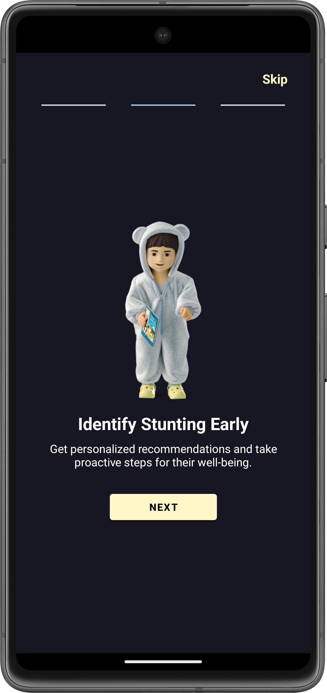 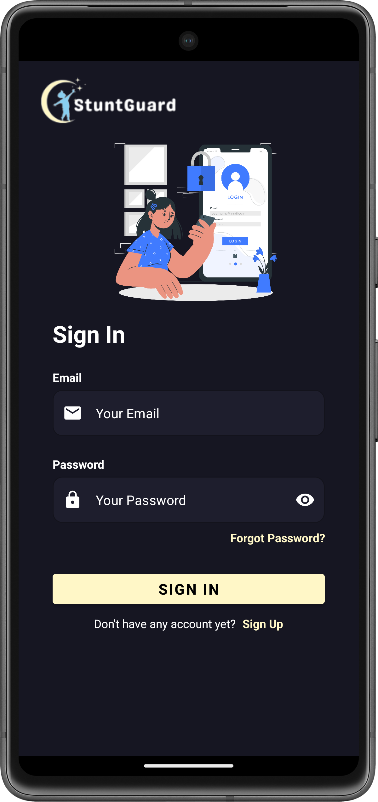 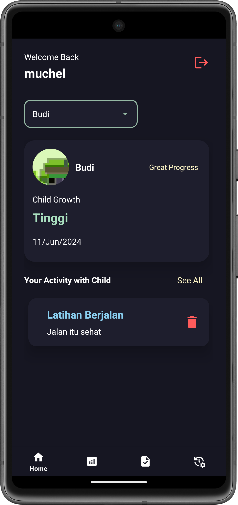
  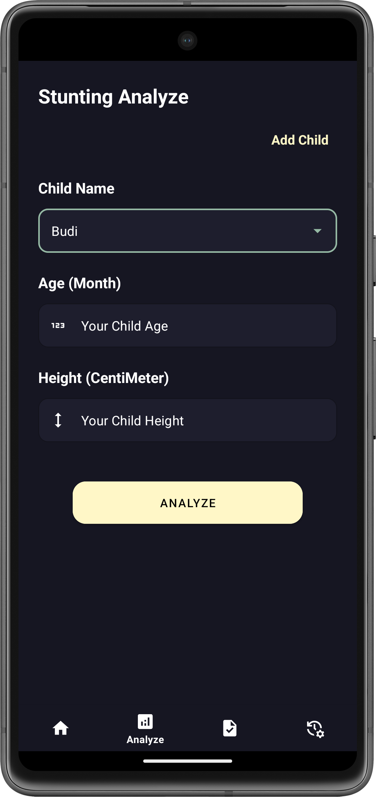 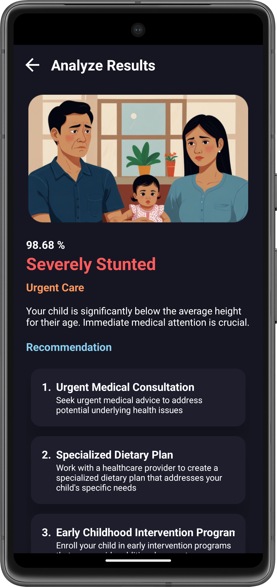 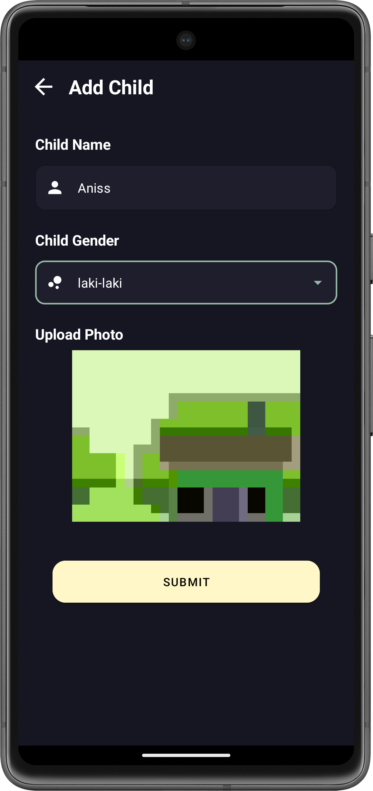
  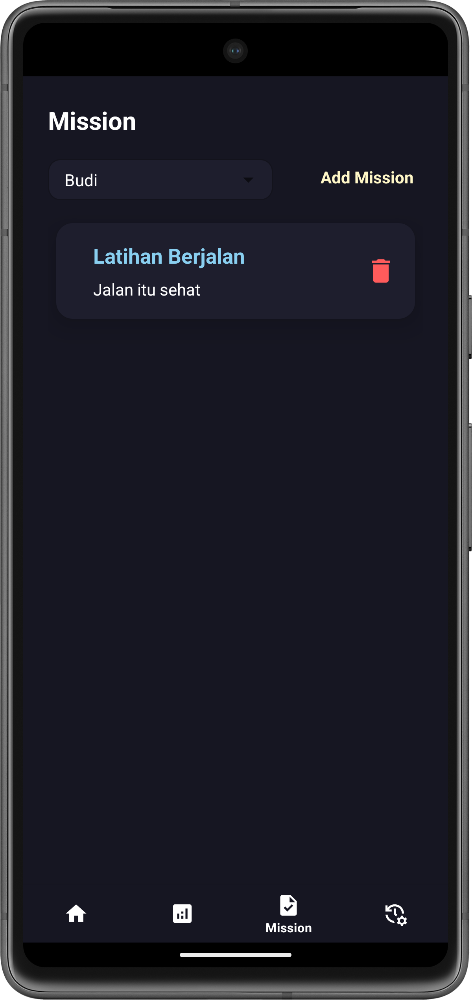 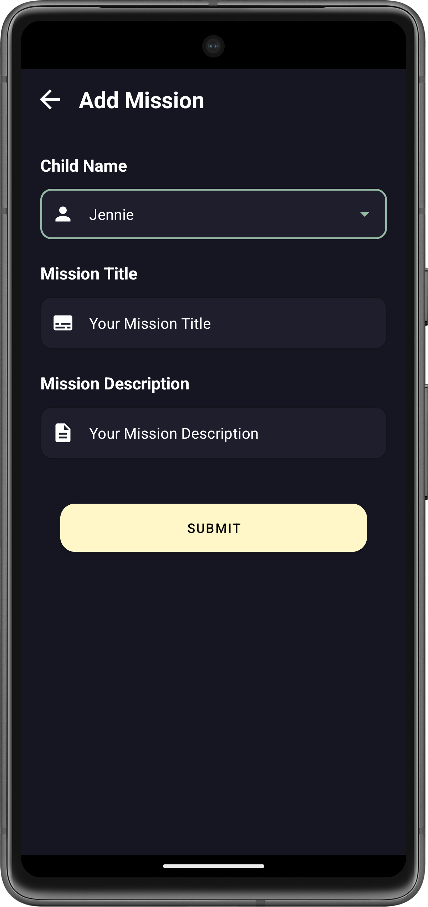 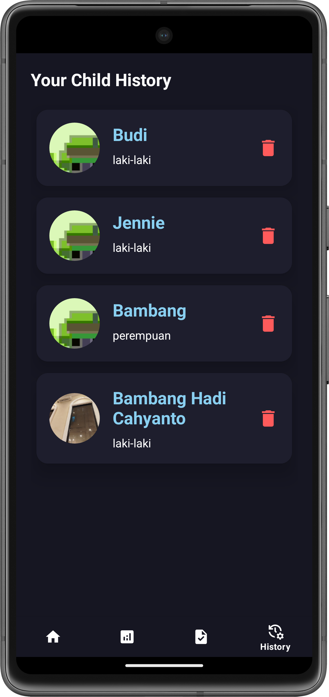
  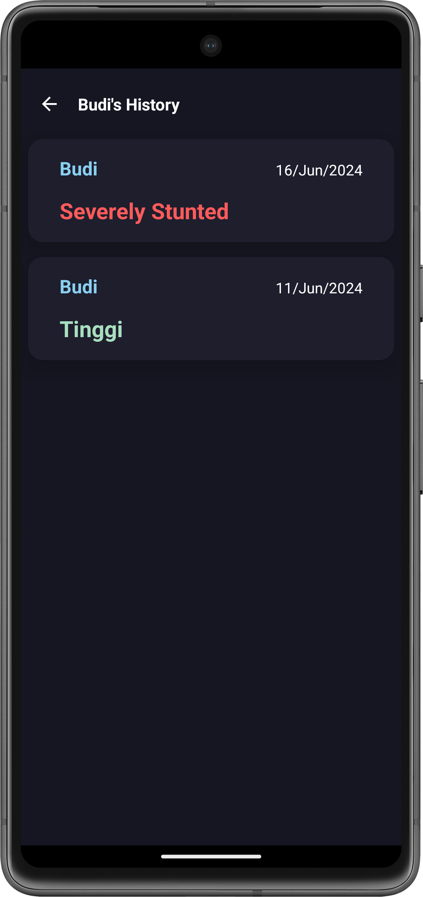

- ### Android Architecture
  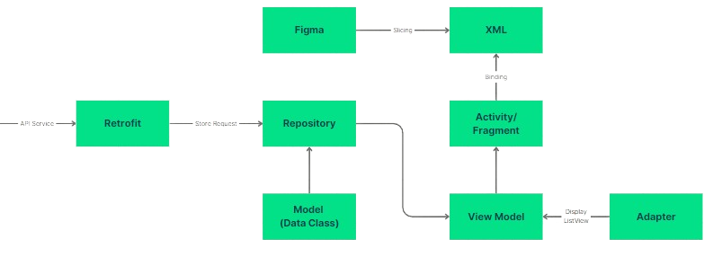

- ### Application's features
  - **Sign In** : Allowing user to use the application by entering registered email and password
  - **Sign Up** : Allowing user to register their name, email, and password to create a new account
  - **Forgot Password** : As an option for user to reset their password by simply enter registered email of your account then enter token that sent to your email and create your new password
  - **Home** : To Monitoring user's child and all activity mission that needed on their child
  - **Analyze** : To analyze user's child based on anthropometric measurements and display the result on other dedicated screen with some follpwing recommendations
  - **Mission** : To Monitoring user's child activity mission and create a new activity mission
  - **History** : To check previous analyze's result of user's child

- ### Getting starteed with StuntGuard
  - #### **Prerequisites**
    - ##### Software tools
      - [Android Studio](https://developer.android.com/studio)
      - [Java Development Kit 8 (optional)](https://www.oracle.com/java/technologies/downloads/?er=221886#java8)

    - ##### Installation
      - Clone the StuntGuard Android Development github repository
        ```
        https://github.com/StuntGuard/android-development.git
        ```
      - Run it on Your android emulator or build an APK (Build > Build Bundle/APK > Build APK)
      
